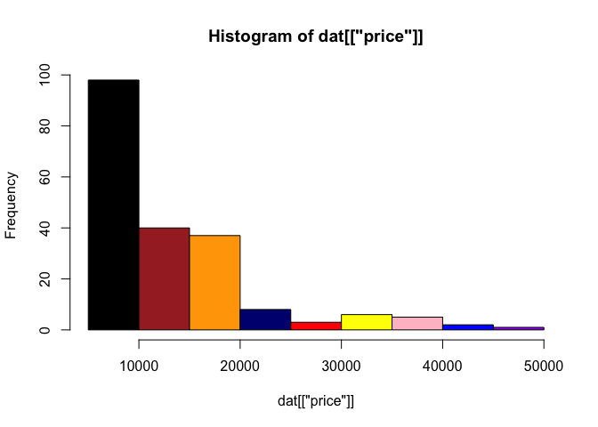
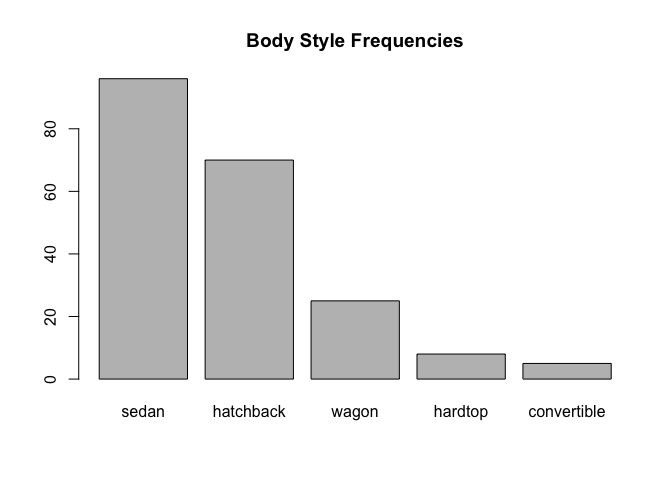
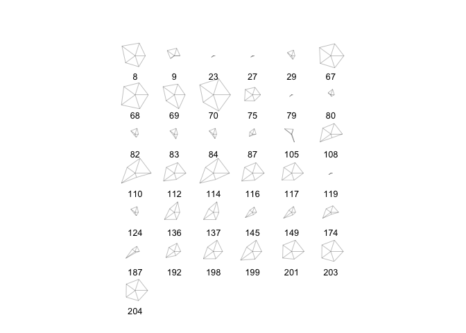
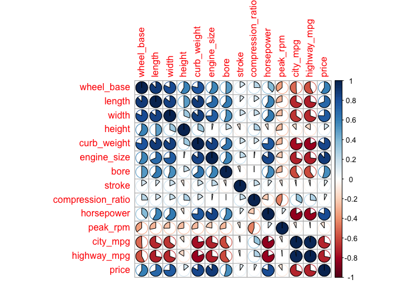
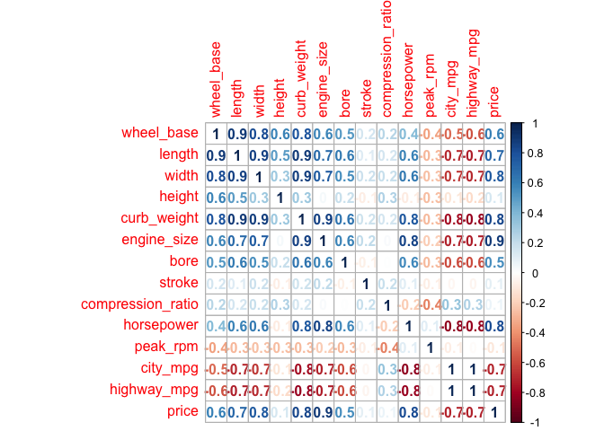
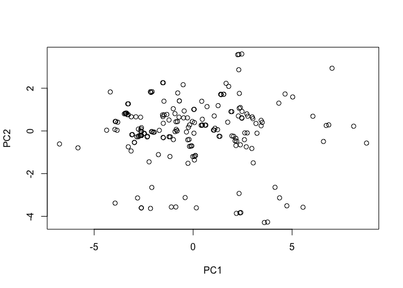
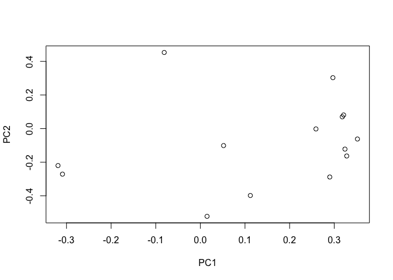

hw01-kris-seo
================
Kris Seo
2/22/2018

Data Import
-----------

#### read.csv() function

``` r
column_names <- c('symboling','normalized_losses','make','fuel_type','aspiration','num_of_doors','body_style','drive_wheels','engine_location','wheel_base','length','width','height','curb_weight','engine_type','num_of_cylinders','engine_size','fuel_system','bore','stroke','compression_ratio','horsepower','peak_rpm','city_mpg','highway_mpg','price')
column_types <- c('real','real','character','character','character','character','character','character','character','real','real','real','real','integer','character','character','integer','character','real','real','real','integer','integer','integer','integer','integer')
dat <- read.csv('imports-85.data', col.names = column_names, colClasses = column_types,na.strings = "?")
str(dat)
```

    ## 'data.frame':    204 obs. of  26 variables:
    ##  $ symboling        : num  3 1 2 2 2 1 1 1 0 2 ...
    ##  $ normalized_losses: num  NA NA 164 164 NA 158 NA 158 NA 192 ...
    ##  $ make             : chr  "alfa-romero" "alfa-romero" "audi" "audi" ...
    ##  $ fuel_type        : chr  "gas" "gas" "gas" "gas" ...
    ##  $ aspiration       : chr  "std" "std" "std" "std" ...
    ##  $ num_of_doors     : chr  "two" "two" "four" "four" ...
    ##  $ body_style       : chr  "convertible" "hatchback" "sedan" "sedan" ...
    ##  $ drive_wheels     : chr  "rwd" "rwd" "fwd" "4wd" ...
    ##  $ engine_location  : chr  "front" "front" "front" "front" ...
    ##  $ wheel_base       : num  88.6 94.5 99.8 99.4 99.8 ...
    ##  $ length           : num  169 171 177 177 177 ...
    ##  $ width            : num  64.1 65.5 66.2 66.4 66.3 71.4 71.4 71.4 67.9 64.8 ...
    ##  $ height           : num  48.8 52.4 54.3 54.3 53.1 55.7 55.7 55.9 52 54.3 ...
    ##  $ curb_weight      : int  2548 2823 2337 2824 2507 2844 2954 3086 3053 2395 ...
    ##  $ engine_type      : chr  "dohc" "ohcv" "ohc" "ohc" ...
    ##  $ num_of_cylinders : chr  "four" "six" "four" "five" ...
    ##  $ engine_size      : int  130 152 109 136 136 136 136 131 131 108 ...
    ##  $ fuel_system      : chr  "mpfi" "mpfi" "mpfi" "mpfi" ...
    ##  $ bore             : num  3.47 2.68 3.19 3.19 3.19 3.19 3.19 3.13 3.13 3.5 ...
    ##  $ stroke           : num  2.68 3.47 3.4 3.4 3.4 3.4 3.4 3.4 3.4 2.8 ...
    ##  $ compression_ratio: num  9 9 10 8 8.5 8.5 8.5 8.3 7 8.8 ...
    ##  $ horsepower       : int  111 154 102 115 110 110 110 140 160 101 ...
    ##  $ peak_rpm         : int  5000 5000 5500 5500 5500 5500 5500 5500 5500 5800 ...
    ##  $ city_mpg         : int  21 19 24 18 19 19 19 17 16 23 ...
    ##  $ highway_mpg      : int  27 26 30 22 25 25 25 20 22 29 ...
    ##  $ price            : int  16500 16500 13950 17450 15250 17710 18920 23875 NA 16430 ...

#### read\_csv() function

``` r
library(readr)
column_names <- c('symboling','normalized_losses','make','fuel_type','aspiration','num_of_doors','body_style','drive_wheels','engine_location','wheel_base','length','width','height','curb_weight','engine_type','num_of_cylinders','engine_size','fuel_system','bore','stroke','compression_ratio','horsepower','peak_rpm','city_mpg','highway_mpg','price')
column_types1 <- cols(symboling = 'n',normalized_losses = 'n',make= 'c', fuel_type = 'c', aspiration = 'c', num_of_doors = 'c', body_style ='c', drive_wheels = 'c', engine_location = 'c',wheel_base = 'n', length = 'n', width = 'n', height = 'n', curb_weight = 'i', engine_type = 'c', num_of_cylinders = 'c', engine_size = 'i', fuel_system = 'c', bore = 'n', stroke = 'n',compression_ratio ='n',horsepower ='n',peak_rpm = 'n',city_mpg = 'n', highway_mpg = 'n', price = 'n')

dat1 <- read_csv('imports-85.data', col_names = column_names, col_types = column_types1, na = c("?","NA"))
str(dat1)
```

    ## Classes 'tbl_df', 'tbl' and 'data.frame':    205 obs. of  26 variables:
    ##  $ symboling        : num  3 3 1 2 2 2 1 1 1 0 ...
    ##  $ normalized_losses: num  NA NA NA 164 164 NA 158 NA 158 NA ...
    ##  $ make             : chr  "alfa-romero" "alfa-romero" "alfa-romero" "audi" ...
    ##  $ fuel_type        : chr  "gas" "gas" "gas" "gas" ...
    ##  $ aspiration       : chr  "std" "std" "std" "std" ...
    ##  $ num_of_doors     : chr  "two" "two" "two" "four" ...
    ##  $ body_style       : chr  "convertible" "convertible" "hatchback" "sedan" ...
    ##  $ drive_wheels     : chr  "rwd" "rwd" "rwd" "fwd" ...
    ##  $ engine_location  : chr  "front" "front" "front" "front" ...
    ##  $ wheel_base       : num  88.6 88.6 94.5 99.8 99.4 ...
    ##  $ length           : num  169 169 171 177 177 ...
    ##  $ width            : num  64.1 64.1 65.5 66.2 66.4 66.3 71.4 71.4 71.4 67.9 ...
    ##  $ height           : num  48.8 48.8 52.4 54.3 54.3 53.1 55.7 55.7 55.9 52 ...
    ##  $ curb_weight      : int  2548 2548 2823 2337 2824 2507 2844 2954 3086 3053 ...
    ##  $ engine_type      : chr  "dohc" "dohc" "ohcv" "ohc" ...
    ##  $ num_of_cylinders : chr  "four" "four" "six" "four" ...
    ##  $ engine_size      : int  130 130 152 109 136 136 136 136 131 131 ...
    ##  $ fuel_system      : chr  "mpfi" "mpfi" "mpfi" "mpfi" ...
    ##  $ bore             : num  3.47 3.47 2.68 3.19 3.19 3.19 3.19 3.19 3.13 3.13 ...
    ##  $ stroke           : num  2.68 2.68 3.47 3.4 3.4 3.4 3.4 3.4 3.4 3.4 ...
    ##  $ compression_ratio: num  9 9 9 10 8 8.5 8.5 8.5 8.3 7 ...
    ##  $ horsepower       : num  111 111 154 102 115 110 110 110 140 160 ...
    ##  $ peak_rpm         : num  5000 5000 5000 5500 5500 5500 5500 5500 5500 5500 ...
    ##  $ city_mpg         : num  21 21 19 24 18 19 19 19 17 16 ...
    ##  $ highway_mpg      : num  27 27 26 30 22 25 25 25 20 22 ...
    ##  $ price            : num  13495 16500 16500 13950 17450 ...
    ##  - attr(*, "spec")=List of 2
    ##   ..$ cols   :List of 26
    ##   .. ..$ symboling        : list()
    ##   .. .. ..- attr(*, "class")= chr  "collector_number" "collector"
    ##   .. ..$ normalized_losses: list()
    ##   .. .. ..- attr(*, "class")= chr  "collector_number" "collector"
    ##   .. ..$ make             : list()
    ##   .. .. ..- attr(*, "class")= chr  "collector_character" "collector"
    ##   .. ..$ fuel_type        : list()
    ##   .. .. ..- attr(*, "class")= chr  "collector_character" "collector"
    ##   .. ..$ aspiration       : list()
    ##   .. .. ..- attr(*, "class")= chr  "collector_character" "collector"
    ##   .. ..$ num_of_doors     : list()
    ##   .. .. ..- attr(*, "class")= chr  "collector_character" "collector"
    ##   .. ..$ body_style       : list()
    ##   .. .. ..- attr(*, "class")= chr  "collector_character" "collector"
    ##   .. ..$ drive_wheels     : list()
    ##   .. .. ..- attr(*, "class")= chr  "collector_character" "collector"
    ##   .. ..$ engine_location  : list()
    ##   .. .. ..- attr(*, "class")= chr  "collector_character" "collector"
    ##   .. ..$ wheel_base       : list()
    ##   .. .. ..- attr(*, "class")= chr  "collector_number" "collector"
    ##   .. ..$ length           : list()
    ##   .. .. ..- attr(*, "class")= chr  "collector_number" "collector"
    ##   .. ..$ width            : list()
    ##   .. .. ..- attr(*, "class")= chr  "collector_number" "collector"
    ##   .. ..$ height           : list()
    ##   .. .. ..- attr(*, "class")= chr  "collector_number" "collector"
    ##   .. ..$ curb_weight      : list()
    ##   .. .. ..- attr(*, "class")= chr  "collector_integer" "collector"
    ##   .. ..$ engine_type      : list()
    ##   .. .. ..- attr(*, "class")= chr  "collector_character" "collector"
    ##   .. ..$ num_of_cylinders : list()
    ##   .. .. ..- attr(*, "class")= chr  "collector_character" "collector"
    ##   .. ..$ engine_size      : list()
    ##   .. .. ..- attr(*, "class")= chr  "collector_integer" "collector"
    ##   .. ..$ fuel_system      : list()
    ##   .. .. ..- attr(*, "class")= chr  "collector_character" "collector"
    ##   .. ..$ bore             : list()
    ##   .. .. ..- attr(*, "class")= chr  "collector_number" "collector"
    ##   .. ..$ stroke           : list()
    ##   .. .. ..- attr(*, "class")= chr  "collector_number" "collector"
    ##   .. ..$ compression_ratio: list()
    ##   .. .. ..- attr(*, "class")= chr  "collector_number" "collector"
    ##   .. ..$ horsepower       : list()
    ##   .. .. ..- attr(*, "class")= chr  "collector_number" "collector"
    ##   .. ..$ peak_rpm         : list()
    ##   .. .. ..- attr(*, "class")= chr  "collector_number" "collector"
    ##   .. ..$ city_mpg         : list()
    ##   .. .. ..- attr(*, "class")= chr  "collector_number" "collector"
    ##   .. ..$ highway_mpg      : list()
    ##   .. .. ..- attr(*, "class")= chr  "collector_number" "collector"
    ##   .. ..$ price            : list()
    ##   .. .. ..- attr(*, "class")= chr  "collector_number" "collector"
    ##   ..$ default: list()
    ##   .. ..- attr(*, "class")= chr  "collector_guess" "collector"
    ##   ..- attr(*, "class")= chr "col_spec"

Technical Questions about importing data
----------------------------------------

##### a) If I don't provide a vector of column names, then read.csv('imports-85.data') will only display the data without column names. The column names will be filled by first row of imports-85.data.

##### b) If I don't provide a vector of column names, then read.csv('imports-85.data', header = FALSE) will display the dataframe without column's names. Column names will be variables such as V1,V2,...Vn .

##### c) If I do not specify how missing values are codified, the data type of those columns that contain '?' occurs an error in read.csv() but, there is no error occuring in read\_csv().

##### d) In terms of bytes, the second option is bigger than the first option because specifying column types will let parameter to pass through types and its column elements has to be the given type.

##### e) If I convert the dat as an R matrix, the non numeric data values return to NA value.

Practice base plotting
----------------------

#### Histogram of price with colored bars.

``` r
hist(dat[['price']], col = c("black","brown",'orange','navy','red','yellow','pink','blue','purple'))
```



#### Boxplot of horsepower in horizontal orientation

``` r
boxplot(dat[['horsepower']],horizontal = TRUE)
```


#### Barplot of the frequencies of body\_style, arranged in decreasing order

``` r
counts <- table(dat$body_style)
barplot(sort(counts, decreasing = TRUE), main="Body Style Frequencies")
```



#### stars() plot of vehicles with turbo aspiration, using only variables wheel-base, length, width, height, and price.

``` r
aspiration_turbo <- dat[(dat$aspiration == 'turbo'), c('wheel_base','length','width','height','price')]
stars(aspiration_turbo)
```



Summaries
---------

#### The mean price of fuel\_type gas cars is 12913.19. The mean price of fuel\_type diesel cars is 15838.15

``` r
price_fuel_gas <-na.omit(dat[(dat$fuel_type =='gas'),'price'])
mean(price_fuel_gas)
```

    ## [1] 12913.19

``` r
price_fuel_diesel <-na.omit(dat[(dat$fuel_type == 'diesel'), 'price'])
mean(price_fuel_diesel)
```

    ## [1] 15838.15

#### The make of the car with twelve num\_of\_cylinders is Jaguar.

``` r
twelve_cyl <- dat[(dat$num_of_cylinders == 'twelve'),'make']
```

#### The make that has the most diesel cars is Peugot.

``` r
make_diesel_car <-dat[(dat$fuel_type == 'diesel'),]
which.max(table(make_diesel_car['make']))
```

    ## peugot 
    ##      4

#### The price of the car with the largest amount of horsepower, which is 288, is a missing value.

``` r
dat[dat$horsepower == max(na.omit(dat$horsepower)), 'price']
```

    ## [1] NA NA NA

#### The bottom 10th percentile of city\_mpg is 17.

``` r
quantile(dat[['city_mpg']], .10)
```

    ## 10% 
    ##  17

#### The top 10th percentile of highway\_mpg is 38.

``` r
quantile(dat[['highway_mpg']], .90)
```

    ## 90% 
    ##  38

#### The median price of those cars in the bottom 10th percentile of city\_mpg is 18685.

``` r
bot_10th_city_mpg <- quantile(dat[['city_mpg']], .10)
median(na.omit(dat[dat$city_mpg == bot_10th_city_mpg,'price']))
```

    ## [1] 18685

Technical Questions about data frames
-------------------------------------

#### a)When I use the dollar $ operator on a data frame, attempting to use the name of a column that does not exist, the null value comes out

#### b) 4

#### c) mtcars\[ , mpg\] fails because mpg has to be in string value such as "mpg".

#### d)Yes, you can include a "R" list as a column of a data frame because column vectors represent the list.

#### e)When I apply as.list() to a dataframe e.g. as.list(dat\['price'\]), the list represents the elements of column named 'price'.

#### f)I can use as.data.frame(abc) to convert the object abc into a data frame.

Correlations of quantitative variables
--------------------------------------

``` r
library(dplyr)
```

    ## 
    ## Attaching package: 'dplyr'

    ## The following objects are masked from 'package:stats':
    ## 
    ##     filter, lag

    ## The following objects are masked from 'package:base':
    ## 
    ##     intersect, setdiff, setequal, union

``` r
library(corrplot)
```

    ## corrplot 0.84 loaded

``` r
dat2 <- na.omit(select(dat, 'wheel_base', 'length', 'width', 'height', 'curb_weight', 
                       'engine_size', 'bore', 'stroke', 'compression_ratio', 'horsepower', 
                       'peak_rpm',   'city_mpg','highway_mpg', 'price'))
M <- cor(dat2)
pie_plot <- corrplot(M, method = 'pie')
```



``` r
#The plot shows how variables correlate to each other by a pie graph.
number_plot <- corrplot(M, method = 'number', number.digits = 1)
```



``` r
#The plot shows how variables correlate to each other by a number. As number is closer to 0, it will mean that there is slight correlation between two variables.
```

Principal Components Analysis
-----------------------------

### 8.1) Run PCA

``` r
matrix_dat <- as.matrix(dat2)
dat_prcomp <- prcomp(matrix_dat, scale. = TRUE)

eigenvalues <- dat_prcomp$sdev^2
summary(dat_prcomp)
```

    ## Importance of components:
    ##                           PC1    PC2     PC3     PC4     PC5     PC6
    ## Standard deviation     2.7476 1.5061 1.11048 0.94160 0.78166 0.64531
    ## Proportion of Variance 0.5392 0.1620 0.08808 0.06333 0.04364 0.02974
    ## Cumulative Proportion  0.5392 0.7013 0.78933 0.85266 0.89631 0.92605
    ##                            PC7     PC8     PC9    PC10    PC11    PC12
    ## Standard deviation     0.56831 0.51521 0.34741 0.33288 0.28410 0.25227
    ## Proportion of Variance 0.02307 0.01896 0.00862 0.00791 0.00577 0.00455
    ## Cumulative Proportion  0.94912 0.96808 0.97670 0.98462 0.99038 0.99493
    ##                           PC13    PC14
    ## Standard deviation     0.22643 0.14049
    ## Proportion of Variance 0.00366 0.00141
    ## Cumulative Proportion  0.99859 1.00000

``` r
#The proportion of variation that is “captured” by the first three components is .78933
```

### 8,2) PCA plot of vehicles, and PCA plot of variables

``` r
matrix_dat <- as.matrix(dat2)
dat_prcomp <- prcomp(matrix_dat, scale. =TRUE)
pca_scores <- data.frame(dat_prcomp$x)
plot(pca_scores[,1],pca_scores[,2],xlab = 'PC1', ylab = 'PC2')
```



``` r
loadings <- dat_prcomp$rotation
df_loadings <- round(loadings, 3)
plot(df_loadings[,1],df_loadings[,2], xlab = 'PC1', ylab = 'PC2')
```



#### Second plot displays how various they are while first plot displays there is a correlation.
